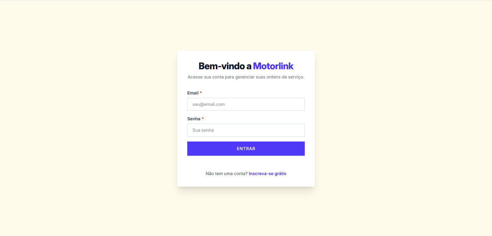
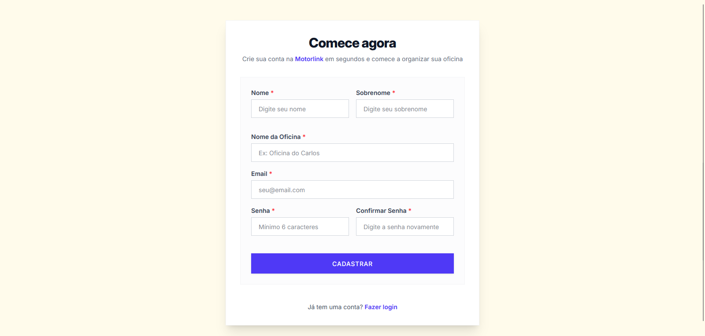
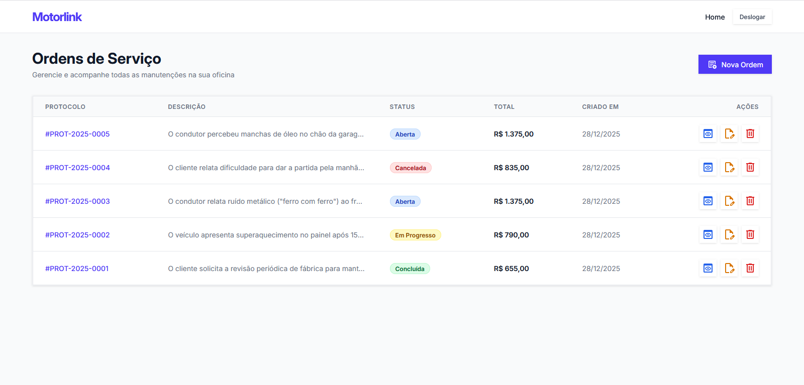
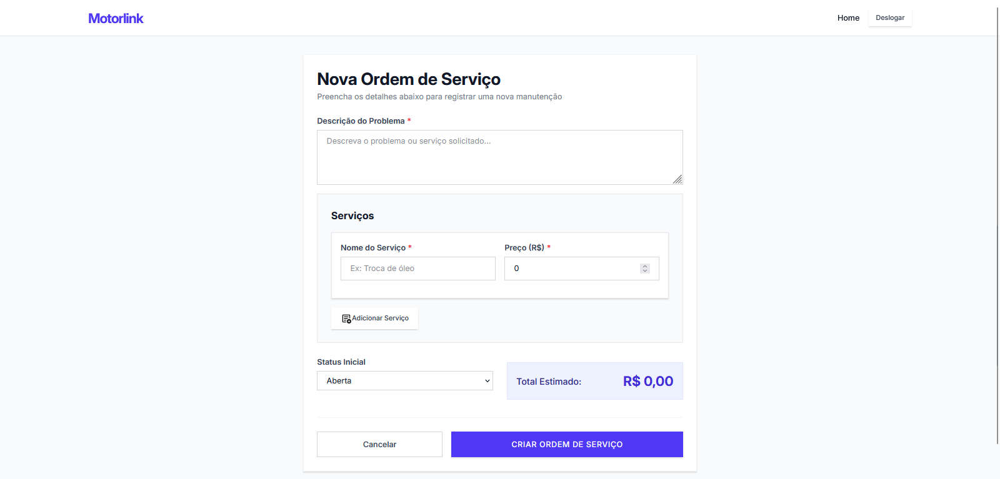

# Atividade de Desenvolvimento Web com React

Este repositório contém o projeto solução para a atividade da disciplina "Modern Web Development - React" do professor Dr. Uedson Reis.

## Sobre o Projeto

O objetivo proposto pelo professor foi a criação de uma `pequena aplicação frontend` composta por `2 (duas)` a `4 (quatro) telas` para que fosse demonstrado os conceitos de componentes, estado, eventos e navegação em React.js.

Para atingir este objetivo, nós implementamos uma estrutura composta por uma API com acesso a um banco de dados em container, e uma aplicação frontend que consome esta API.

A aplicação como um todo foi desenvolvida para criar e manipular `Ordens de Serviço` para `centros de serviços automobilísticos`, como por exemplo, Oficinas Mecânicas.


## Aprendizados com este Projeto

Em sala de aula o professor ministrou uma introdução ao React e seus conceitos principais, como `componentes`, `estados`, `props`, `ciclo de vida` e `hooks`, assim como apresentou estes conceitos usando o React Router já na versão 7, que apresenta mudanças significativas em relação ao sua versão 6.

Em aula ou por estudo complementar nós estudamos também conceitos relacionados ao React Router, como `loaders`, `clienLoaders`, `actions` e `clientActions`, com foco na construção deste projeto.

Por exemplo, entre os conceitos estudados, podemos falar sobre os `loaders` e `actions`, estes rodam no servidor.

- **loaders** realizam a busca de dados antes do componente renderizar e é ideal para busca de informações em banco de dados e APIs protegidas que o cliente não deve acessar diretamente;
- **actions** processam o envio de formulários (POST, PUT, DELETE), por exemplo, salvar algo no banco de dados, e após a sua execução chamam os loaders da pagina para que executem novamente.
- `clientLoader` e `clientAction` rodam diretamente no browser do cliente, são parecidos com os `loaders` e `actions`, mas por rodarem no navegador podem ter acesso a recursos dos mesmos, por exemplo, um `loader` não tem acesso ao sessionStorage e localStorage, pelo fato destas serem APIs do navegador, mas o `clientLoader` e o `clientAction`, que vivem no navegador possuem acesso a estes recursos.

A escrita do código pode até ocorrer no mesmo arquivo, mas na geração do bundle da aplicação React Router o compilador cria 02 (dois) bundles distintos, um `Server Bundle` que contém loaders, actions e componentes para SSR e um `Client Bundle` na qual o compilador remove as funções loader e action (que irão rodar no servidor) para que elas não sejam enviadas para o navegador do usuário.

Além desses conceitos acima, também há vários outros recursos e comportamentos tanto do React quanto do React Router que merecem atenção especial.

**Importante:** Este projeto é um projeto de estudos, implementamos diversos recursos, entretanto, vários outros recursos ficaram por implementar. Então, você pode até usar este projeto para estudo, mas não recomendamos ele em produção, até por que, ele foi construído apenas para ser executado em ambiente de desenvolvimento.

## Integrantes do Grupo

Abaixo estão os alunos responsáveis pelo desenvolvimento desta atividade:

- Adelvan Junior Pires Lima
- Andrea Ferreira da Silva
- Fernando Rocha Gonçalves
- Rafael Augusto Mattiuzzo
- Thomás Réa Farias


## Tecnologias Utilizadas neste Projeto

### Backend
- Nest.js
- TypeORM
- PostgreSQL
- JWT
- Swagger/OpenAPI
- Bcrypt

### Frontend
- React Router v7
- TypeScript
- TailwindCSS
- Vite

### Conteinerização do Banco de Dados
- Docker e Docker Compose


## Telas Implementadas

### Tela de Login




### Tela de Cadastro de Usuários





### Tela de Listagem de Ordens de Serviço (também é o index)





### Tela de Cadastro de Ordem de Serviço





## Pré-requisitos
- [Node.js](https://nodejs.org/pt) (Este projeto foi desenvolvido usando a versão 24, mas pode ser executado em versões menores.)
- [Docker](https://www.docker.com/get-started/) e Docker Compose
- npm

## Configuração Inicial

### Clone o repositório

Clone o repositório com o comando abaixo:

```bash
git clone https://github.com/projetomotorlink/atividade-de-desenvolvimento-web-com-react.git
```

Então, acesse o repositório criado.

```bash
cd atividade-de-desenvolvimento-web-com-react
```

### Configure as variáveis de ambiente

Crie o arquivo `.env` na **raiz do projeto** a partir do exemplo fornecido:

```bash
cp .env.example .env
```

Você também pode fazer esse procedimento manualmente, copiando o arquivo `.env.example` e renomeando a cópia que foi gerada para `.env`.

**Observação:** No ambiente Windows o comando `cp` e outros não funcionam no `cmd` (o prompt de comandos), mas funcionam no `PowerShell`.

Após a criação do arquivo `.env` edite as variáveis de ambiente conforme necessário. Entretanto, as configurações padrão já funcionam para desenvolvimento local.

### Configure o backend

Copie o arquivo `.env` para dentro da pasta `backend`:

```bash
cp .env backend/.env
```

# Importante!

Não esqueça o passo anterior de `também` ter uma cópia do arquivo `.env` na pasta `backend/` para que a API possa ler as configurações e acessar o banco de dados.

Nós estamos usando o docker neste projeto apenas para evitar ter de instalar um banco de dados PostgreSQL diretamente na maquina local.

Ou seja:

* .env - na raiz do projeto
* .env - na pasta backend (`backend/.env`).

---

### Inicie o banco de dados

Na raiz do projeto, execute:

```bash
docker-compose up -d
```

Isso iniciará um container PostgreSQL na porta 5432.

## Instalação

### Backend

Acesse a pasta do projeto `backend/`.

```bash
cd backend
```

E instale as dependências da aplicação Nest.js.

```bash
npm install
```

### Frontend

Acesse a pasta do projeto `frontend/`.

```bash
cd frontend
```

E instale as dependências da aplicação React Router.

```bash
npm install
```

## Execução da aplicação

### Execução das migrações do banco de dados

No diretório `backend` (e com o container do banco de dados já em execução), execute o seguinte comando:

```bash
npm run m:run
```

### Inicie o backend

Ainda no diretório `backend` execute:

```bash
npm run start:dev
```

Se tudo ocorreu bem, a API estará disponível no endereço: `http://localhost:3000`


### Inicie o frontend

Em outro terminal, no diretório `frontend` execute:

```bash
npm run dev
```

O frontend estará disponível em: `http://localhost` (mais exatamente: `http://localhost:80`)

### Documentação da API

Com o backend em execução, você pode ter acessoa documentação Swagger pelo seguinte endereço:

```bash
http://localhost:3000/docs
```

## Scripts Disponíveis

### Backend

- `npm run start:dev` - Inicia o servidor em modo desenvolvimento
- `npm run build` - Compila o projeto
- `npm run m:gen` - Gera uma nova migration
- `npm run m:run` - Executa as migrations pendentes
- `npm run m:rev` - Reverte a última migration
- `npm run test` - Executa os testes
- `npm run test:e2e` - Executa os testes E2E

### Frontend

- `npm run dev` - Inicia o servidor de desenvolvimento
- `npm run build` - Compila o projeto para produção
- `npm run start` - Inicia o servidor de produção


## Ultimas Considerações

Estamos felizes por termos concluído este projeto, esperamos que gostem.

Atenciosamente, Grupo 02 - Motorlink.
